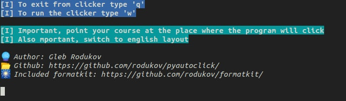

# pyautoclick
The simplest autoclicker in the terminal. In fact, autoclicker is cli of pyautogui and pynput libraries. 
I would say, this is very small and convenient script. He is has clear and readable source code. So suitable for beginners 

## How to run cli?
First, clone repository: `git clone https://github.com/rodukov/pyautoclick` 
Next, go inside folder: `cd pyautoclick` 
After, install requirements: `pip3 install -r requirements.txt` 
And last, execute main: `python3 main.py`
